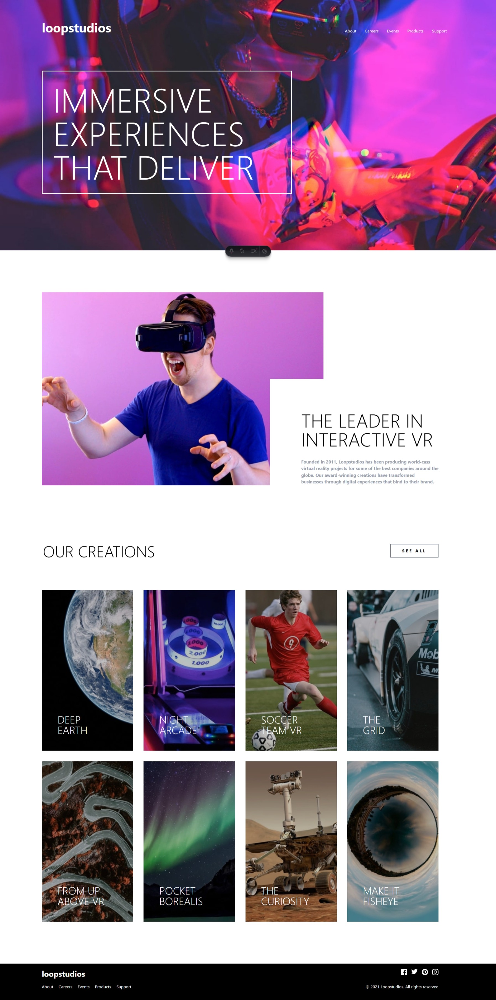

# 🏝️ Proyecto: Loopstudios Landing Page

Este proyecto consiste en el desarrollo de la **landing page de Loopstudios** utilizando **Astro** y **Tailwind CSS**.  
El objetivo es aplicar los conocimientos sobre **componentes de Astro**, **maquetación**, **estilos responsivos** y **utilidades CSS** para construir un diseño limpio, moderno y adaptable a diferentes dispositivos.

---

## 📖 Descripción general

### 🧩 Vista previa del proyecto
Agrega aquí una **captura de pantalla** del resultado final de tu landing page.  

---

### 🔗 Enlaces del proyecto

- **Repositorio en GitHub:** (https://github.com/Emmanuel2508/Loopstudios-Landing-Page)
- **Sitio desplegado (opcional):** [Agrega aquí la URL del proyecto desplegado, si usaste Vercel o Netlify](https://)

---

## 🧠 Proceso de desarrollo

### 🛠️ Tecnologías utilizadas
Lista las herramientas y tecnologías que utilizaste en el proyecto. Por ejemplo:

- [Astro](https://astro.build)
- [Tailwind CSS](https://tailwindcss.com/)
- HTML5 semántico
- Diseño responsivo (Mobile-first)
- Componentes de Astro reutilizables

---

### 💡 Lo que aprendí
En esta ocasion aprendi bastante sobre el funcionamiento de hover en los botones, aplicar una imagen 
de fondo y segmentar las diferentes partes de la pagina para trabajar de mannera mas sencilla.
---

### 🚀 Áreas de mejora

Mejorar en crear la pagina con un diseño responsivo

---

### 📚 Recursos útiles

Incluye los enlaces, documentación o tutoriales que te ayudaron a completar este proyecto.

**Ejemplo:**
- [Documentación de Astro](https://docs.astro.build)  
- [Guía oficial de Tailwind CSS](https://tailwindcss.com/docs)  
- [tutoriales de w3schools](https://www.w3schools.com/)

---

### 👩‍💻 Autor

- **Nombre completo: Emmanuel Pedroza Perez**  
- **Carrera: Ing. Tecnologias de la informacion y comunicaciones**  
- **Grupo: TC1**  
- **Correo institucional: 23151202@aguascalientes.tecnm.mx**  

---

### ✨ Reflexión final

Me encanto esta practica por el diseño que tuvimos que recrear. Tambien me gustaron 
los efectos de los botones al poner el cursor encima del boton.
Para finalizar me hubiera gustado corregir la version movil pero le ofrezco una disculpa
la semana estuve con problemas de la quimioterapia y tenia muy poca energia.
